<!--
  natishmourani/natishmourani — profile README
  The visual is portfolio.svg. Everything below it exists because a GitHub
  README renders SVG through an  tag, which means links *inside* the SVG
  are not clickable and its text is not selectable or searchable. This file
  restores both.
-->

<!-- One image, no theme variants: the SVG carries its own dark ground,
     so it reads identically in GitHub light and dark mode. -->

  

